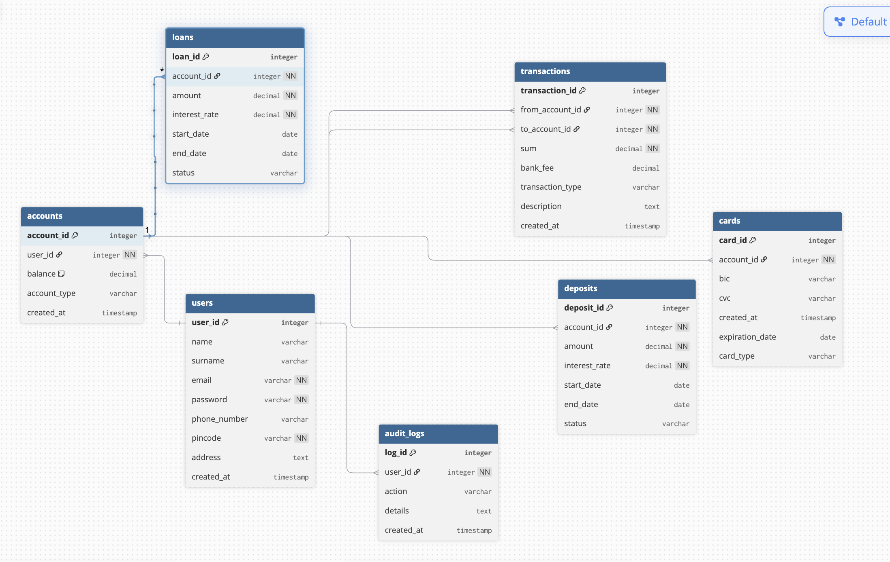

# Lab work 1.
###  Part 1.
1. Write description of the project;

2. Identify all entities, attributes, relationships and cardinality ratios of your project;
If any many-to-many relationship exists in your E/R diagram, split it into two one-to-many relationships. If there is any one-to-one relationship in your E/R diagram, consider merging the two entities involved into a single one;

3. Draw ER diagram with requered tools ( ERDPlus, Draw.io, DB Fiddle).


## My Solution



# Lab Work 1 — Parts 1 & 2 (Banking Information System)

## Part 1 — Project Description (Concise)

* **Goal.** Store core banking data: customers, accounts, transactions, cards, loans, deposits, and an append-only audit trail.
* **Scope/assumptions.** Single currency (USD). Balance lives on **accounts**; all money movement is an atomic **transaction** with `from_account_id` and `to_account_id`. **Loans/Deposits** are products attached to an account; repayments/payouts are recorded as transactions. **Audit logs** capture who/what/when. No remaining M\:N or 1:1 relations.
* **Key constraints.** Unique `users.email`; required FKs; `sum > 0` and `from_account_id ≠ to_account_id`; parent deletes restricted; timestamps on core rows; index PKs/FKs and frequently searched columns (`email`, `account_id`, `created_at`).

## Part 2 — Entities, Attributes, Relationships & Cardinalities

### Entities & Attributes

| Entity          | Attributes                                                                                                                              |
| --------------- | --------------------------------------------------------------------------------------------------------------------------------------- |
| **User**        | `user_id (PK)`, `email (UNIQUE)`, `password`, `pincode`, `name`, `surname`, `phone_number`, `address`, `created_at`                     |
| **Account**     | `account_id (PK)`, `user_id (FK)`, `balance`, `account_type`, `created_at`                                                              |
| **Transaction** | `transaction_id (PK)`, `from_account_id (FK)`, `to_account_id (FK)`, `sum`, `bank_fee`, `transaction_type`, `description`, `created_at` |
| **Card**        | `card_id (PK)`, `account_id (FK)`, `bic`, `cvc`, `expiration_date`, `card_type`, `created_at`                                           |
| **Loan**        | `loan_id (PK)`, `account_id (FK)`, `amount`, `interest_rate`, `start_date`, `end_date`, `status`                                        |
| **Deposit**     | `deposit_id (PK)`, `account_id (FK)`, `amount`, `interest_rate`, `start_date`, `end_date`, `status`                                     |
| **AuditLog**    | `log_id (PK)`, `user_id (FK)`, `action`, `details`, `created_at`                                                                        |

### Relationships & Cardinality

* **User (1) — (0..N) Account**
* **Account (1) — (0..N) Transaction** (via `from_account_id` and via `to_account_id`)
* **Account (1) — (0..N) Card / Loan / Deposit**
* **User (1) — (0..N) AuditLog**

*Notes:* No M\:N remains (transfers are two FKs in `transactions`). No 1:1 needed. Optionality shown by `0..N` on child sides.


### 3. ER diagram (executable on dbdiagram.io)
```
// Users
Table users {
  user_id integer [primary key]
  name varchar
  surname varchar
  email varchar [unique, not null]
  password varchar [not null]
  phone_number varchar
  pincode varchar [not null]
  address text
  created_at timestamp
}

// Accounts
Table accounts {
  account_id integer [primary key]
  user_id integer [not null]
  balance decimal [default: 0]
  account_type varchar
  created_at timestamp
}

// Transactions
Table transactions {
  transaction_id integer [primary key]
  from_account_id integer [not null]
  to_account_id integer [not null]
  sum decimal [not null]
  bank_fee decimal
  transaction_type varchar
  description text
  created_at timestamp
}

// Cards
Table cards {
  card_id integer [primary key]
  account_id integer [not null]
  bic varchar
  cvc varchar
  created_at timestamp
  expiration_date date
  card_type varchar
}

// Loans
Table loans {
  loan_id integer [primary key]
  account_id integer [not null]
  amount decimal [not null]
  interest_rate decimal [not null]
  start_date date
  end_date date
  status varchar
}

// Deposits
Table deposits {
  deposit_id integer [primary key]
  account_id integer [not null]
  amount decimal [not null]
  interest_rate decimal [not null]
  start_date date
  end_date date
  status varchar
}

// Audit logs
Table audit_logs {
  log_id integer [primary key]
  user_id integer [not null]
  action varchar
  details text
  created_at timestamp
}

// Relationships
Ref: accounts.user_id > users.user_id
Ref: transactions.from_account_id > accounts.account_id
Ref: transactions.to_account_id > accounts.account_id
Ref: cards.account_id > accounts.account_id
Ref: loans.account_id > accounts.account_id
Ref: deposits.account_id > accounts.account_id
Ref: audit_logs.user_id > users.user_id

```