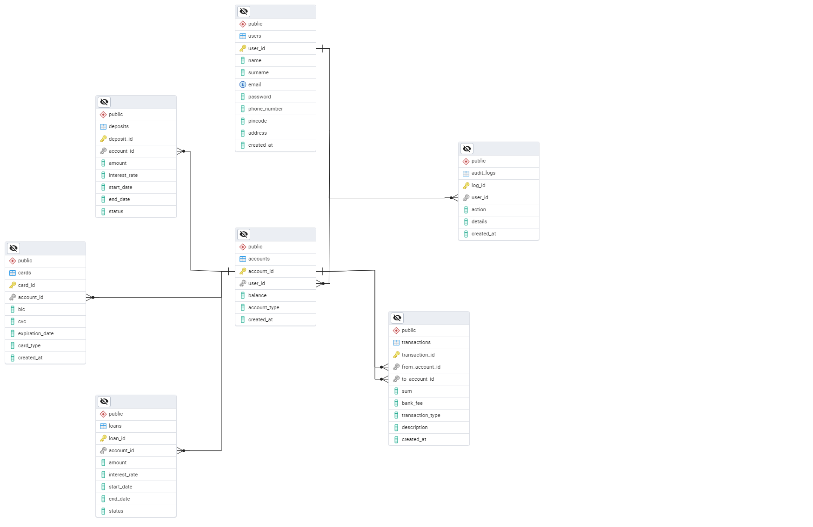

# Lab Work 2



### SQL Commands to Create the Database and Tables

```sql
-- Create the database
-- CREATE DATABASE banking_system;

-- Switch to the new database
-- \c banking_system;

-- Create the users table
CREATE TABLE users (
  user_id SERIAL PRIMARY KEY,
  name VARCHAR(100),
  surname VARCHAR(100),
  email VARCHAR(255) UNIQUE NOT NULL,
  password VARCHAR(255) NOT NULL,
  phone_number VARCHAR(15),
  pincode VARCHAR(4) NOT NULL,
  address TEXT,
  created_at TIMESTAMP DEFAULT CURRENT_TIMESTAMP
);

-- Create the accounts table
CREATE TABLE accounts (
  account_id SERIAL PRIMARY KEY,
  user_id INT NOT NULL,
  balance DECIMAL(15, 2) DEFAULT 0,
  account_type VARCHAR(50),
  created_at TIMESTAMP DEFAULT CURRENT_TIMESTAMP,
  FOREIGN KEY (user_id) REFERENCES users(user_id) ON DELETE CASCADE
);

-- Create the transactions table
CREATE TABLE transactions (
  transaction_id SERIAL PRIMARY KEY,
  from_account_id INT NOT NULL,
  to_account_id INT NOT NULL,
  sum DECIMAL(15, 2) NOT NULL,
  bank_fee DECIMAL(15, 2),
  transaction_type VARCHAR(50),
  description TEXT,
  created_at TIMESTAMP DEFAULT CURRENT_TIMESTAMP,
  FOREIGN KEY (from_account_id) REFERENCES accounts(account_id) ON DELETE CASCADE,
  FOREIGN KEY (to_account_id) REFERENCES accounts(account_id) ON DELETE CASCADE
);

-- Create the cards table
CREATE TABLE cards (
  card_id SERIAL PRIMARY KEY,
  account_id INT NOT NULL,
  bic VARCHAR(10),
  cvc VARCHAR(3),
  expiration_date DATE,
  card_type VARCHAR(50),
  created_at TIMESTAMP DEFAULT CURRENT_TIMESTAMP,
  FOREIGN KEY (account_id) REFERENCES accounts(account_id) ON DELETE CASCADE
);

-- Create the loans table
CREATE TABLE loans (
  loan_id SERIAL PRIMARY KEY,
  account_id INT NOT NULL,
  amount DECIMAL(15, 2) NOT NULL,
  interest_rate DECIMAL(5, 2) NOT NULL,
  start_date DATE,
  end_date DATE,
  status VARCHAR(50),
  FOREIGN KEY (account_id) REFERENCES accounts(account_id) ON DELETE CASCADE
);

-- Create the deposits table
CREATE TABLE deposits (
  deposit_id SERIAL PRIMARY KEY,
  account_id INT NOT NULL,
  amount DECIMAL(15, 2) NOT NULL,
  interest_rate DECIMAL(5, 2) NOT NULL,
  start_date DATE,
  end_date DATE,
  status VARCHAR(50),
  FOREIGN KEY (account_id) REFERENCES accounts(account_id) ON DELETE CASCADE
);

-- Create the audit logs table
CREATE TABLE audit_logs (
  log_id SERIAL PRIMARY KEY,
  user_id INT NOT NULL,
  action VARCHAR(255),
  details TEXT,
  created_at TIMESTAMP DEFAULT CURRENT_TIMESTAMP,
  FOREIGN KEY (user_id) REFERENCES users(user_id) ON DELETE CASCADE
);
```

### How to Run These Commands

**psql**:

- Open the terminal and type the following to connect to PostgreSQL:

  ```bash
  psql -U postgres
  ```

- Then, execute the SQL commands in the PostgreSQL prompt.

**or using pgAdmin**
