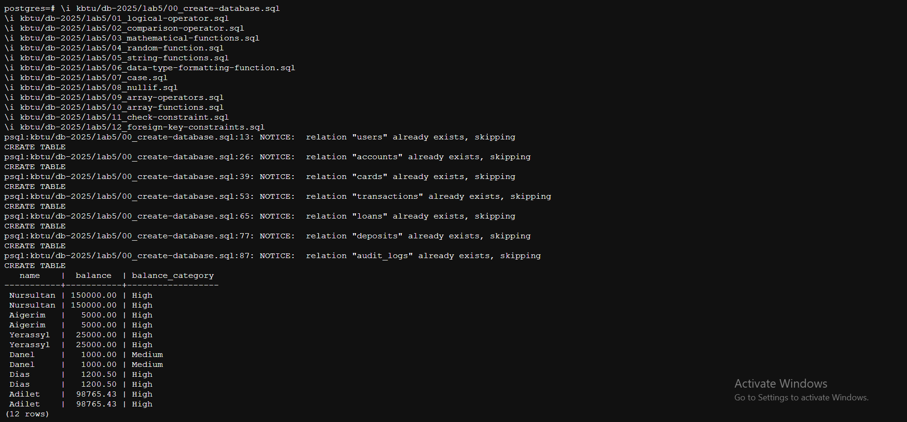
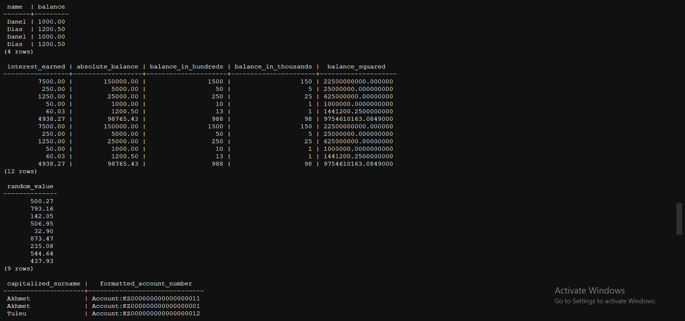
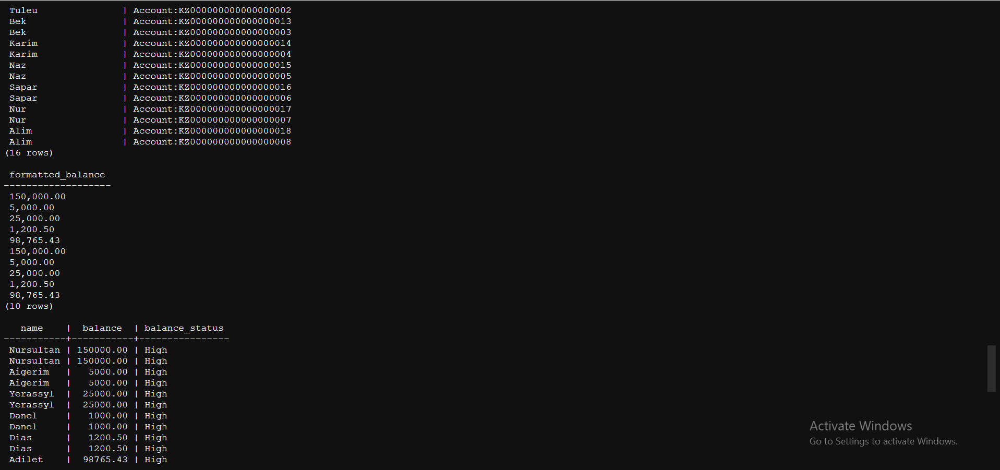
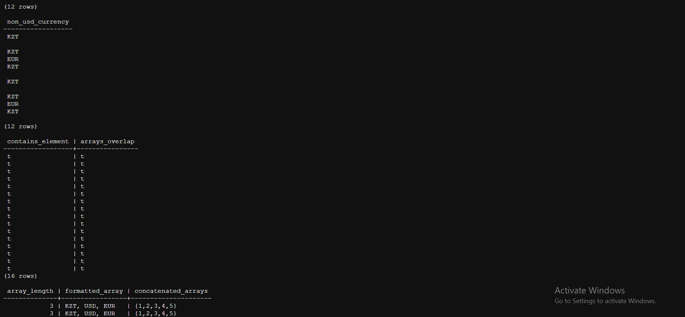
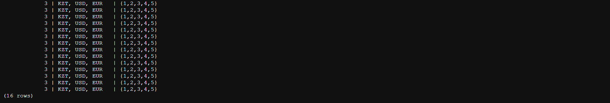

# Lab 5 - Functions and Operators

### The items are wrote in this lab
- Logical operator 
- Comparison operator 
- 5 mathematical functions 
- random function 
- 2 string functions 
- data type formatting function 
- case  
- NULLIF 
- 2 Array operators, 3 array functions 
- check constraint 
- Foreign key constraint with all options - (restrict, cascade, set null, set default, no action) 

### in next executable files:
```zsh 
\i db-2025/lab5/00_create-database.sql
\i db-2025/lab5/01_logical-operator.sql
\i db-2025/lab5/02_comparison-operator.sql
\i db-2025/lab5/03_matical-functions.sql
\i db-2025/lab5/04_random-function.sql
\i db-2025/lab5/05_string-functions.sql
\i db-2025/lab5/06_type-formatting-function.sql
\i db-2025/lab5/07_case.sql
\i db-2025/lab5/08_nullif.sql
\i db-2025/lab5/09_array-operators.sql
\i db-2025/lab5/10_array-functions.sql
\i db-2025/lab5/11_check-constraint.sql
```
### Screenshots:




