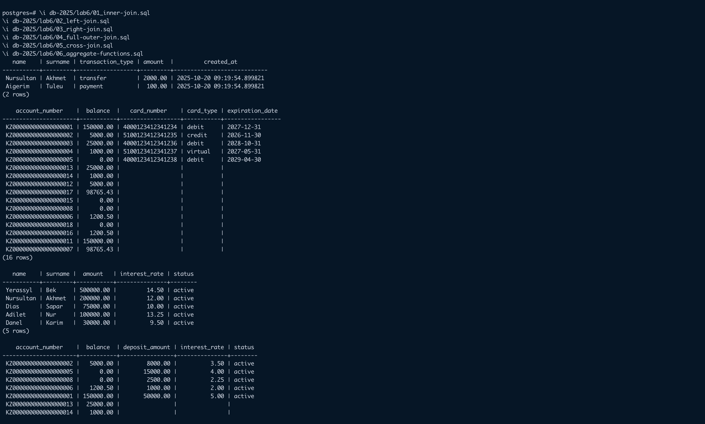

# Lab 6 - Joins and Aggregate Functions

### The items are wrote in this lab
- INNER JOIN
- LEFT JOIN
- RIGHT JOIN
- FULL OUTER JOIN
- CROSS JOIN
- All Aggregate functions with Having clause

### in next executable files:
```zsh
\i db-2025/lab6/00_create-database.sql
\i db-2025/lab6/01_inner-join.sql
\i db-2025/lab6/02_left-join.sql
\i db-2025/lab6/03_right-join.sql
\i db-2025/lab6/04_full-outer-join.sql
\i db-2025/lab6/05_cross-join.sql
\i db-2025/lab6/06_aggregate-functions.sql
```
### Screenshots:

